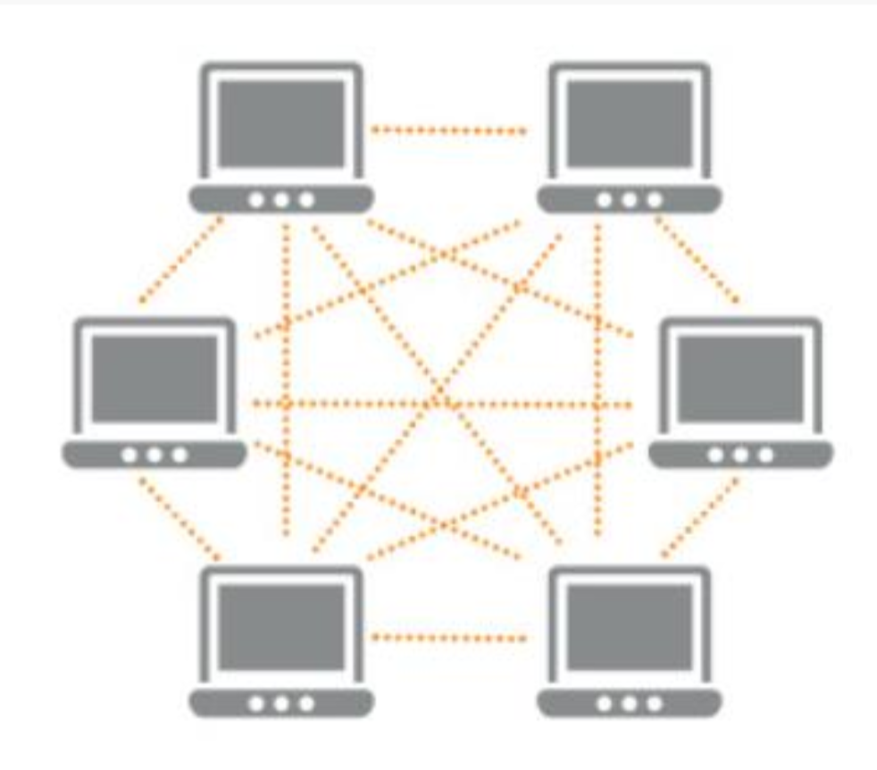

### L14 -Introduction to Blockchain and Bitcoin
## Module content
* Construction and structure of blockchains
* Distributed trust and consensus
* Proof of Work›Block content and transactions
* Examples of blockchains (e.g. Bitcoin and Ethereum)
* Smart contracts›Ecosystems and infrastructure
* Application areas.

## Learning resources, I
[Website for Bitcoin and Cryptocurrency Technologies](http://bitcoinbook.cs.princeton.edu/)
### Free draft of the book
[Bitcoin and Cryptocurrency Technologies, The book](https://d28rh4a8wq0iu5.cloudfront.net/bitcointech/readings/princeton_bitcoin_book.pdf)

## Learning resources, II
[The Bicoinwhitepaper](https://bitcoin.org/bitcoin.pdf) by Satoshi Nakamotocan

## Learning resources, III (cursory)
### [Mastering Bitcoin](https://github.com/bitcoinbook/bitcoinbook)
Mastering Bitcoin is a book for developers, although the first two chapters cover bitcoin at a level that is also approachable to non-programmers. Anyone with a basic understanding of technology can read the first two chapters to get a great understanding of bitcoin.

This repository contains the complete [first edition, second print](https://github.com/bitcoinbook/bitcoinbook/releases/tag/Edition1Print2), published in December 2014, and the complete [second edition, second print](https://github.com/bitcoinbook/bitcoinbook/releases/tag/second_edition_print2), published in July 2017, as published by O'Reilly Media in paperback and ebook formats.

### Free draft of the book
[Bitcoin book](https://github.com/bitcoinbook/bitcoinbook/releases/tag/second_edition_print2)

- - - -

# Lecture Notes
A bitcoin amount is always associated with a bitcoin address. Think of the address as an account number. The address is a hash of a public key.  
When we transfer (spend) bitcoin, it "moves" from one address to another.  

To spend bitcoin, you have to provide the private key for the sender address to prove that you "own" this address.  
Think of the private key as a password.  
A key-pair is created, from a random number, according to the Elliptic Curve Digital Signature Algorithm (ECDSA).  

## Key creation
In Bitcoin, a private key is a 256-bit number  
Nearly every 256-bit number is a valid ECDSA private key  
=> The number of keys is 2256 ~ 1077~ number of atoms in the universe  
So if you create a truly random private key, there is ~ zero chance that someone else can guess or create the same key. Even with much computing power, it is really hard to brute force a guess of your key. (In practice, there are more private keys than addresses (2160), but still ...)
## Bitcoin Network

## Bitcoin Network With a distributed ledger

## Block Explorers
The data in the Bitcoin blockchain is publicly available  
But the format is not human understandable  
There are a lot of applications that shows / visualizes / gives read-access to the data in the blockchain  
These are called block explorers  
[Example](https://live.blockcypher.com/)
