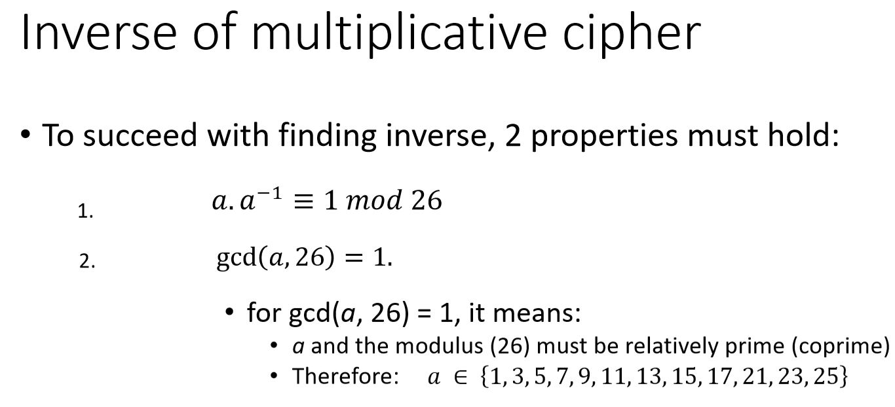
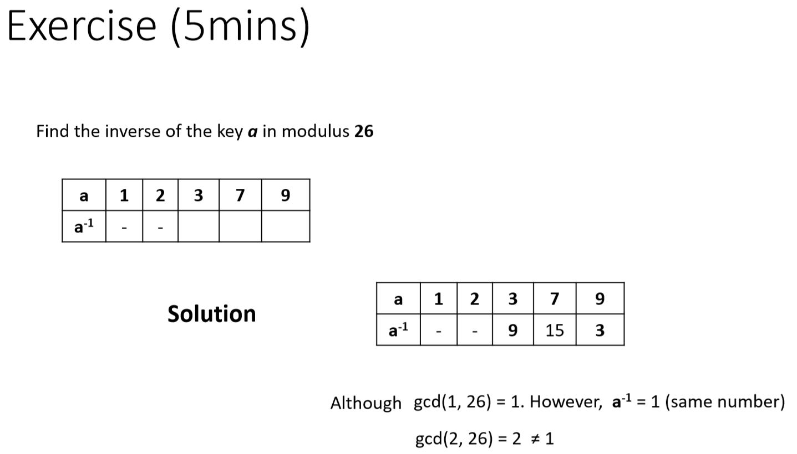

## Think about how to decrypt the Affine Cipher

## Decryption

## Inverse'of'multiplicative'cipher

## How to compute the inverse of a key (Trial and Error Approach

## Exercise

## Decryption

## Computational effort to break Affine Cipher

$$12 \* 26 = 312$$

- Brute-force 312 keys.

## Cryptoanalysis o Affine Cipher

- The Affine cipher incresed the key space over shift cipher
- However, it is still susceptible to:
  - Brute-Force and Frequency analysis attacks

Ciphertext: $y = \{VKZIBEVCCH\}$
