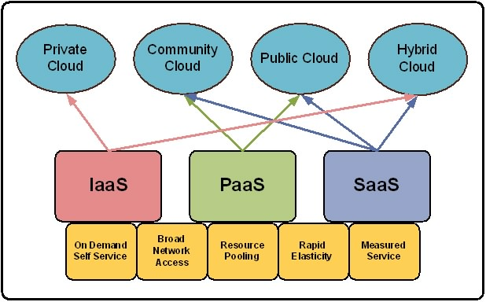
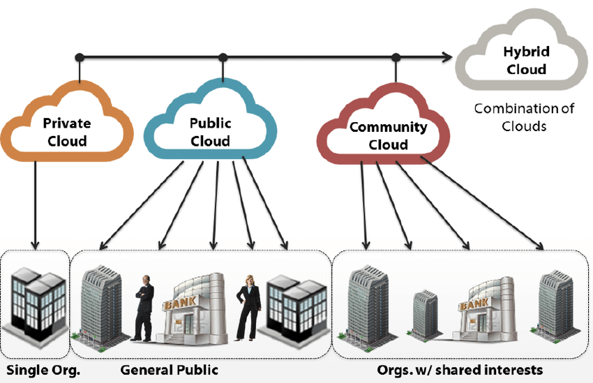
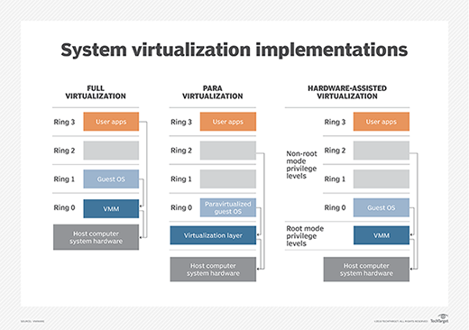

## Characteristics of Cloud Computing

### On-demand self service

Cloud computing resources can be provisioned on-demand by the users, without requiring interactons with the cloud service provider. The process of provisioning resources is automated.

### Broad network access

Cloud computing resources can be accessed over the network using standard access mechanisms that provide platform-independent access through the use of heterogeneous client platforms such as workstations, laptops, tablets and smartphones.

### Resource pooling

The computing and storage resources provided by cloud service providers are pooled to serve multiple users using multi-tenancy. Multi-tenancy aspects of the cloud allow multiple users to be served by the same physical hardware. Users are assigned virtual resources that run on top of the physical resources.

### Rapid elasticity

Cloud resources ca be rapidly scaled up or down based on demand. Two types of scaling options exists:

> **Horizontal Scaling (scaling out)**  
> Horizontal scaling or scaling-out involves launching and provisioning additional server resources.

> **Vertical Scaling (scaling up)**  
> Vertical scaling or scaling-up involves changing the computing capacity assigned to the server resources while keeping the number of servers resources constant

### Meaured service

Cloud computing resources are provided to users on a pay-per-use model. Metrics such as amount of CPU cycles used, amount of storage space used, number of network I/O requests, etc. are used to calculate the usage charges of the cloud resources.

### Performance

Cloud computing provides improved performance for applications since the resources available to the application can be scaled up or down based on the dynamic application workloads.

### Reduced costs

Cloud computing provides cost benefits for applications as only as much computing and storage resources as required can be provisioned dynamically, and upfront investment in purchase of computing assets to cover worst case requirements is avoid.

### Outsorced Managment

Cloud computing allows the users to outsource the IT infrastructure requirements to external cloud providers.

### Reliability

Applications deployed in cloud computing environments generally have a higher reliability since the underlying IT infrastructure is professionally managed by the cloud service. Most cloud providers delivers a SLA (service level agreements) with promise of 99.99% uptime guarantee for the cloud resources, witch may often be expensive to achieve with in-house IT infrastructure.

### Multi-tenancy

The multi-tenanted approach of the cloud allows multiple users to make use of the same shared resources. Multi-tenanct can be of different forms:

> **Virtual multi-tenancy**  
> In virtual multi-tenancy, computing and storage resources are shared among multiple users. Multiple tentant are served from virtual machines (VMs) that execute concurrently on top of the same computing and storage resources.

> **Organic multi-tenancy**  
> In a organic multi-tenancy every component in the system architecture is shared among multiple tentants, including hardware, OS, database servers, application servers, load balances, etc. Organic multi-tenancy exists when explicit multi-tenant design patterns are coded into the application.

## Cloud Models

### Service Models

#### Infrastructure-as-a-Service (IaaS)

IaaS provides the users the capability to provision computing and storage resources. These resources are provided to the users as virtual machines instances and virtual storage. Users can start, stop, configure and manage the virtual machine instances and virtual storage.Users can deploy operating systems and applications of their choise on the virtual resources provisioned in the cloud. The cloud service provider manages the underlying infrastructure. The users are billed on the pay-per-useparadigm. Common metering used are the number of virtual machines hours used and/or the amount of storage space provisioned.

##### Platform-as-a-Service (PaaS)

PaaS provides the users the capability to develop and deploy application in the cloud using the development tools, application programming interfaces (API's), software libraries and services provided by the cloud service provider. The cloud service provider manages the underlying cloud infrastructures including servers, network, operating systems and storage. The users, themselves, are repsonsible for developing, deploying, configuring and managing applications on the cloud infrastructure.

##### Software-as-a-Service (SaaS)

SaaS provides the users a complete software appliation or the user interface to the application itself. The cloud service provider manages the underlying cloud infrastructure including servers, network, operating systems, storage and application software, and the user is unaware of the underlying architecture of the cloud. Applications are privided to the user through a thin client interface (e.g., a browser)

### Deployment Models

#### Public cloud

In the public deployment model, cloud services are available to the general public or a large group of companies. The cloud resources are shared among different users. The cloud services are provided by a third.party cloud provider. Public clouds are best suited for users who want to use cloud infrastructure for development and testing of applications and host applications in the cloud toserve large workloads, without upfront investments in IT infrastructure.

#### Private cloud

In the private cloud deployment model cloud infrastructure is operated for exclusive use of a single organization. Private cloud services are dedicated for a single organization. Cloud infrastructure can be setup on premise or off-premise and may be managed internally or by a third-party. Private clouds are best suited for applications where security is very important and organizations that want to have very tight control over their data.

#### Hybrid cloud

The hybrid cloud deployment model compines the services of multiple clouds (private or public). The individuals retain their unique identities but are bound by standarized or proprietary technology that enables data and application portability. Hybrid clouds are best suited for organizations that want to take advantage og secured application nd data hosting on a private cloud, and at the same time benefit from cost savings by hosting shared applications and data in public clouds.

#### Community cloud

In the community cloud deployment, the cloud services are shared by several organizations that have the same policy and compliance considerations. Community clouds are best suited for organizations that want access to the same applications and data, and want the cloud costs to be shared with the larger group.

## Cloud Concepts and Technologies

### Virtualization

Virtualixation refers to the partitioning the resources of a physical systeminto mulitple virtual resources. Virtualization is the key enabling techology if cloud computing and allows pooling of resources. In cloud computing, resources are pooled to serve mulitple users using multi-tenancy. Multi-tenant aspect of the cloud allow multiple users to be served by the same physical hardware. The virtualization layer allows multiple operating system instances to run currently as virtual machines on the same underlying physical resources.

#### Hypervisor

The virtualization layer consists of a hypervisor or a virtual machine monitor (VMM) The hypervisor presents a virtual operating platform to a guest operating system (OS). There are two types of hypervisors:

> **Type-1 hypervisors**  
> Type-1 hypervisors or native hypervisors run directly on the host hardware and control the hardware and monitor the guest operating systems.

> **Type-2 hypervisors**  
> Type-2 hypervisors or hosted hypervisors run on top of a conventional (main/host) operating system and monitor the guest systems.

#### Guest OS

A guest OS is an operating system that is installed in a virtual machine in addition to the host or main OS. In virtualization, the guest OS can be different from the host OS.

#### Full virtualization

In full virtualization, the virtualization layer completley decouples the guest OS from the underlying hardware. The guest OS requires no modification and is not aware that it is being virtualized. Full virtualization is enabled by direct execution of user requests and binary translation of OS requests.

#### Para-virtualization

In para-virtualization the guest OS is modified to enable communication with the hypervisor to improve performance and efficiency. The guest OS kernel is modified to replace non-virtualizable instructions with hypercalls that communicate directly with the virtualization layer hypervisor.

#### Hardware virtualization

Hardware assisted virtualization is enabled by hardware features such as Intel's Virtualization Technology (VT-x) and AMD's AMD-V. In hardware assisted virtualization, privileged and sensitive calls are set to automatically trap to the hypervisor. Thus, there is no need for either inary ranslation or para-virtualization.

### Load balancing

Load balancing distribute workloads across mulitple servers to meet the application workloads. The goal if load balancing techinque are to achieve maximum utilization of resources, minimizing he response times, maximizing throughput. Load balancing distribute the incomming user requests aross mulitiple resources. To the end user accessing a cloud-basd application, a load balancer makes the pool of servers under the load balancer appear as a single server with high computing capacity. The routing of user requests is determined based on a load balancing algorithm, Comonly used load balancing algorithms include:

| Algorithm            | Description                                                                                                                                                                                                                                       |
| -------------------- | ------------------------------------------------------------------------------------------------------------------------------------------------------------------------------------------------------------------------------------------------- |
| Round Robin          | The servers are selected one by one to serve the incomming requests in a non-hierarchial circular fashion with no priority assigned to a specific server.                                                                                         |
| Weighted Round Robin | Servers are assigned some weights. The incomming requests are proportionally routed using a static or dynamic ratio of respective weights.                                                                                                        |
| Low Latency          | The load balancer monitors the latency of each server. Each incoming request is routed to the server whitch has the lowest latency.                                                                                                               |
| Least Connections    | The incoming requests are routed to the server with the least number of connections.                                                                                                                                                              |
| Priority             | Each server is assigned a proprity. The incomming traffic is routed to the highest priority server as long as the server is available. When the highest priority server fails, the incomming traffic is routed to a server with a lower priority. |
| Overflow             | Similar to priority load balancing. When the incomming requests to highest priority server overflow, the requests are routed to a lower priority server.                                                                                          |

For session based applications, an important issue to handle during load balancing is the persistence of multiple requests from a particular user session. ince load balancing can route successive requests from a user session to different servers, maintaining the state or the information of the session is important.

| Approach         | Description                                                                                                                                                                                                                                                                  |
| ---------------- | ---------------------------------------------------------------------------------------------------------------------------------------------------------------------------------------------------------------------------------------------------------------------------- |
| Sticky sessions  | All requests belonging to a user session are routed to the same server. Solution is simple to manage, the drawback of this approach is that if a server fails all the sessions belonging to that server is lost.                                                             |
| Session Database | All the session information is stored externally in a seperate session database, which is often replicated to avoid single point of failure. But the approach involves additional overhead storing the session information, however this approach allows automatic failover. |
| Browser cookies  | The session information is stored on the client side in form of a cookie. The benefit of this approach is that it makes session managment east and has the least amount of overhead for the load balancer.                                                                   |

### Scalability and elasticity

### Deployment

### Monitoring

### Software Defined Networking (SDN)

### MapReduce

### Identity and Access Managment

### Service Level Agreements

### Billing
