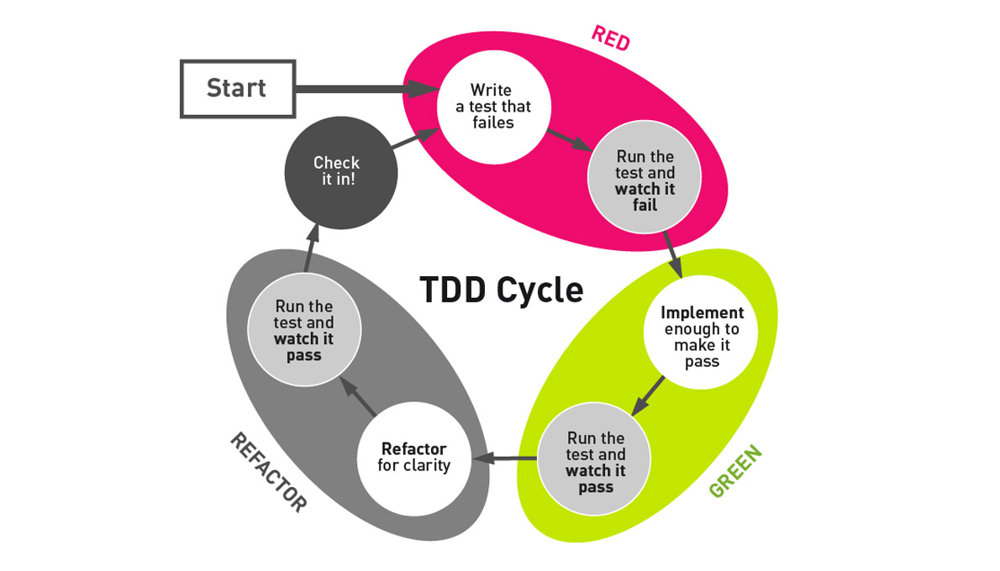

## Goals

- The ultimate goal of performing refactoring on your code is to make it clearer to understand and thereby more effecient to maintain
- Refactoring changes the code internally by altering its structure, but it does not under any circumstances create change to the external behaviour of the code

## Way of working

- Refactoring is heavily based on test driven development.

## Bad smells within classes

[Overview of smells](https://blog.codinghorror.com/code-smells/)

- Long Methods
- Long Parameter List
- Duplicated code
- Conditional Complexity
- Combinitorial Explosion
- Large Class
- Type Embedded in Name
- Uncommunicative Name
- Inconsistent Names
- Dead Code
- Speculative Generality
- Oddball Solution
- Temporary Field
- Switch statements

## Bad smells between classes

- Alternative Classes with Different Interfaces
- Primitive Obsession
- Data Clumps
- Refused Bequest
- Inappropriate Intimacy
- Indecent Exposure
- Feature Envy
- Lazy Class
- Message Chains
- Middle Man
- Divergent Change
- Shotgun Surgery
- Parallel Inheritance Hierarchies
- Incomplete Library Class
- Solution Sprawl

[Grouping of smells](http://mikamantyla.eu/BadCodeSmellsTaxonomy.html)

## Cooking recepies

[Cooking recepies](http://www.industriallogic.com/wp-content/uploads/2005/09/smellstorefactorings.pdf)

[Refactor Catalog](https://refactoring.com/catalog/)